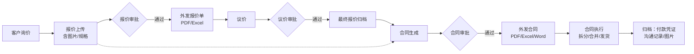

# 长立-外贸订单 CRM 售前梳理

> 📎 关联：[[OSCG/01-客户档案/长立/00-README]] · 原始素材：[[售前]]
> 🎯 本文档定位：售前阶段对长立外贸订单 CRM 的整体理解、核心痛点与模块方案初稿，作为后续 [[调研-业务流程]] 与 [[需求-外贸订单CRM-V1.0]] 的输入。

![[77424b230e7506f343223316e01f3790.png]]

---

## 一、项目理解与系统定位

### 1.1 系统定位

本系统**不是单纯记录客户跟进的普通 CRM**，而是以**外贸客户询价、历史价格、报价审批、议价确认、合同履约和跨部门协同**为核心的**订单管理 CRM**。

系统需要把每一次报价、议价、成交、发货、回款和沟通资料都沉淀到以下五个核心维度上：

| # | 主数据维度 | 说明 |
|---|------------|------|
| 1 | 【客户】 | 外贸客户主体 |
| 2 | 【客户号码】 | 客户侧产品编号 |
| 3 | 【长立号码】 | 本厂内部产品编号（核心主键） |
| 4 | 【报价单号】 | 报价/议价追溯依据 |
| 5 | 【合同号】 | 履约与归档依据 |

### 1.2 建设目标

让 **销售 / 审批人 / 跟单 / 计划 / 采购 / 生产 / 开发 / 财务** 在同一套数据链路里协作，规避以下断层：

- ❌ 报价信息断层
- ❌ 价格依据丢失
- ❌ 合同执行靠线下表格
- ❌ 图片凭证无法追溯

---

## 二、核心痛点

| # | 痛点 | 优先级 |
|---|------|--------|
| 1 | 报价历史分散，销售难以及时查到某【客户号码】或【长立号码】最近报过什么价、最终成交过什么价 | 高 |
| 2 | 一个【长立号码】可能对应多个【客户号码】，需按【长立号码】归集历史报价和成交价格，并展示来源客户、时间和单据 | 高 |
| 3 | 报价 / 议价 / 合同阶段都会修改产品信息、图片、备注和价格，需保存**版本**和**审批过程** | 高 |
| 4 | 审批人需要能改价格、删商品行，但所有修改必须有记录，**不得覆盖原始申请数据** | 高 |
| 5 | 合同不能脱离报价或最终议价生成，否则合同价格、图片、客户要求和审批依据无法追溯 | 高 |
| 6 | 合同生成后涉及跟单 / 计划 / 采购 / 生产 / 开发 / 财务，多部门间需自动同步任务和资料 | 中 |
| 7 | 发货箱单、发货清单、取消或修改产品申请等表单**必须由合同产品行生成**，避免线下表格造成数据不一致 | 中 |
| 8 | 付款凭证、沟通截图、产品图片、包装要求和流程表单需按合同**永久归档** | 中 |

---

## 三、主流程总览

---

## 四、报价模块

### 4.1 报价上传 --预估 待评估

- **Excel 批量导入**报价产品行，并**保留客户原始询价附件**
- 每个产品行支持**3 张以上图片**，建议默认 **3–10 张**，可按客户或业务类型调整上限
- 报价字段**可自定义**，至少包括：

| 字段 | 类型 | 说明 |
|------|------|------|
| 【客户号码】 | Char | 客户侧编号 |
| 【长立号码】 | Char | 内部编号（可后补） |
| 【品名】 | Char | |
| 【规格】 | Char | |
| 【材质】 | Char | |
| 【颜色】 | Char | |
| 【包装】 | Text | |
| 【数量】 | Float | |
| 【币种】 | Selection | USD / EUR / RMB ... |
| 【目标价】 | Monetary | 客户期望价 |
| 【报价】 | Monetary | 我方报价 |
| 【行备注】 | Text | 销售说明 / 客户特殊要求 / 内部注意事项 |

- 报价产品行**必须有独立备注列**
- 报价阶段产品信息**不能强制调用商品信息库**，作为**独立快照**保存
- **无【长立号码】产品可先报价**，生成合同时再补充或标记为「待补充」

### 4.2 报价审批与外发 --预估 待评估

1、系统根据【客户号码】和【长立号码】**自动匹配最近历史报价与合同成交价**
2、销售提交报价审批 → 进入【待审批】
3、总经理 / 审批人审核：可改价格、删商品行、填写审批意见（**留痕，不覆盖原始数据**）
4、审批通过 → 系统生成**正式报价单** → 销售选择模板导出 PDF / Excel 发客户
5、报价单进入【已外发】或【待客户反馈】状态

---

## 五、议价模块

> 💡 **关键定位**：议价**不是重新创建报价**，而是在已批准报价基础上选择相应型号，确认客户最终价格和特殊要求。

### 5.1 议价流程 --预估 待评估

1、销售从【已批准报价单】中选择部分或全部型号发起议价
2、议价过程中可修改议价产品的价格、产品信息、图片和产品备注
3、若客户对图片、规格或其他有异议，销售填写【客户异议】和【特殊要求】
4、议价提交 → 进入审批流程
5、审批通过 → 生成【最终报价记录】

### 5.2 最终报价记录字段

| 字段 | 说明 |
|------|------|
| 【原报价价格】 | 议价前价格 |
| 【议价后价格】 | 客户最终确认价 |
| 【客户反馈】 | 客户异议 / 特殊要求 |
| 【图片版本】 | 议价阶段图片快照 |
| 【产品备注】 | |
| 【审批意见】 | |
| 【确认时间】 | |

---

## 六、合同模块

### 6.1 合同生成方式 --预估 待评估

支持以下 **4 种生成路径**：

| # | 来源 | 说明 |
|---|------|------|
| 1 | 单个报价表部分产品 | 从最近报价表中选择部分产品生成合同 |
| 2 | 整个报价单 | 一键带入全部产品行 |
| 3 | 多个报价单组合 | 跨报价单选择产品行组合成一个合同 |
| 4 | 最终议价记录 | 从议价归档生成合同 |

- 无【长立号码】产品在生成合同时**补充长立号码**，或进入【待补充提醒】

### 6.2 合同审批 --预估 待评估

1、销售生成合同**草稿**
2、系统**自动带入**：报价/议价来源、图片、历史价格节点、客户要求、包装要求、发货要求
3、销售提交合同审批
4、审批人查看合同产品、图片、历史价格引用、价格时间节点和客户要求
5、审批通过 → 销售选择外发合同模板生成 PDF / Excel / Word

### 6.3 外发合同模板 --预估 待评估

- **字段可选**：客户信息、产品图片、产品备注、包装要求、交期、付款条款、贸易条款、【客户号码】、【长立号码】
- **模板维度**：中英文模板、带图/不带图模板、不同客户专属模板
- **导出格式**：PDF / Excel / Word
- **版本管理**：保存每次导出的版本

---

## 七、合同执行（拆分 / 合并 / 发货）

> 💡 **原则**：合同执行以**合同产品行 × 数量**为最小管理单位。

- 拆分、合并、发货必须**从原合同产品行选择**
- 系统不允许超过【未发数量】
- 发货箱单、发货清单、取消或修改产品申请等表单**必须由合同产品行生成**

---

## 八、跨部门协同

合同审批通过后需自动触达：

| 部门 | 接收内容 |
|------|----------|
| 跟单 | 合同明细、交期、客户要求 |
| 计划 | 数量、交期、长立号码 |
| 采购 | 物料需求、供应商参考 |
| 生产 | 工艺、图片、规格 |
| 开发 | 新品需求、打样要求 |
| 财务 | 合同金额、付款条款、币种 |

---

## 九、归档要求

按【合同号】**永久归档**：

- 付款凭证截图
- 客户沟通截图（邮件、IM、微信）
- 产品图片（各阶段版本）
- 包装要求
- 流程表单（拆分、发货、变更）

---

## 十、待确认事项

- [ ] 【长立号码】编码规则（前缀 / 流水号 / 校验位）
- [ ] 【客户号码】是否允许同一编号绑定多个长立号码？
- [ ] 图片每行上限默认值（建议 10）与单张大小限制
- [ ] 报价审批层级：单审 / 多审 / 金额分级？
- [ ] 议价是否允许多轮（V1 / V2 / V3）？
- [ ] 合同外发模板的客户专属版本预估数量
- [ ] 跨部门协同方式：站内推送 / 邮件 / IM 集成？
- [ ] 财务对接：是否需要与现有财务系统打通？
- [ ] 多币种汇率来源与锁定时点（报价/议价/合同各阶段）

---

## 十一、后续动作

1. 与客户对齐**待确认事项**，输出 [[调研-业务流程]]
2. 根据调研结论沉淀 [[需求-外贸订单CRM-V1.0]] 并补全工时
3. 报价 → 议价 → 合同的**价格版本快照**机制建议沉淀到 [[02-知识库/实施案例/价格版本快照]]
4. 多客户号码-单长立号码的**历史价格归集**逻辑可沉淀为通用案例
