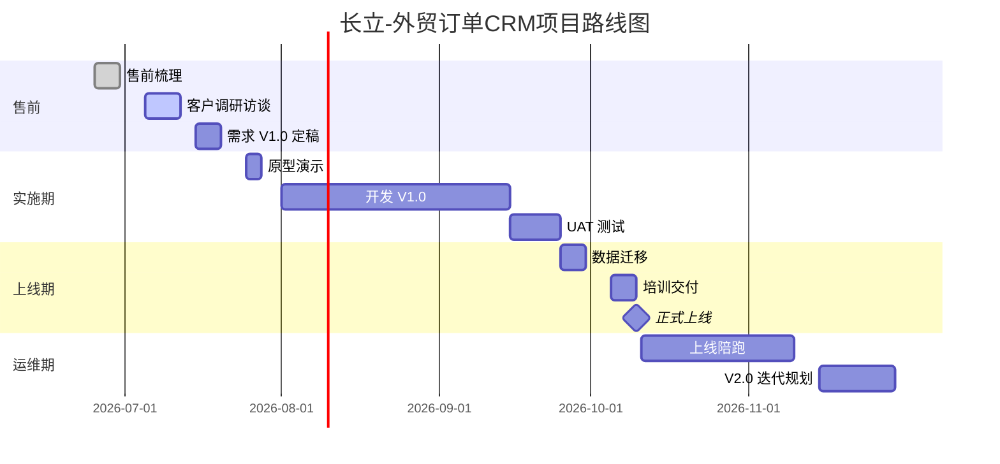

# 长立-外贸订单 CRM 项目规划 V0.1

> 📎 关联：[[00-README]] · [[方案-外贸订单CRM-售前]] · [[调研-业务流程]]
> 🎯 本文档定位：长立外贸订单 CRM 项目从**售前 → 上线 → 运维**的完整路径规划，作为客户对齐、内部资源调配、里程碑管理的顶层依据。

---

## 一、项目背景

### 1.1 客户诉求

长立作为外贸型制造企业，现有报价 / 议价 / 合同管理主要依赖 Excel 与线下沟通，存在以下核心问题：

- 报价历史分散，难追溯
- 一个【长立号码】对应多【客户号码】的历史价格无法归集
- 合同执行靠线下表格，跨部门协同断层
- 图片凭证、沟通记录无法按合同归档

### 1.2 项目目标

用 Odoo 构建**外贸订单 CRM**，实现：

1. **主数据统一**：【长立号码】+【客户号码】双主键体系
2. **价格版本快照**：报价 / 议价 / 合同三段冻结点全程可追溯
3. **审批留痕**：审批人改价、删行不覆盖原始数据
4. **跨部门自动协同**：合同审批后自动触达跟单 / 计划 / 采购 / 生产 / 开发 / 财务
5. **合同永久归档**：付款凭证、沟通截图、图片按【合同号】归档

### 1.3 项目边界

**在范围内**：
- ✅ 报价 / 议价 / 合同全链路
- ✅ 主数据（【长立号码】/ 客户 / 产品快照）
- ✅ 审批流（报价 / 议价 / 合同 3 层）
- ✅ 外发模板（PDF / Excel / Word / 中英文 / 客户专属）
- ✅ 合同执行（拆分 / 合并 / 发货）
- ✅ 跨部门协同（消息推送 / 任务分发）
- ✅ 归档模块

**不在范围内**（V1 阶段暂不做）：
- ❌ 生产排程详细逻辑
- ❌ WMS 深度对接
- ❌ 财务凭证生成（走 Odoo 标准）
- ❌ 移动端 App（走 Web 响应式）

---

## 二、项目阶段规划

### 2.1 总体路线图

### 2.2 阶段划分

| 阶段 | 起止时间（预估） | 交付物 | 里程碑 |
|------|-----------------|--------|--------|
| **① 售前** | 2026-06-25 ~ 07-20 | 售前梳理、调研问卷、需求 V1.0 | 需求评审通过 |
| **② 实施期** | 2026-07-25 ~ 09-25 | 原型、二开代码、UAT 报告 | UAT 验收通过 |
| **③ 上线期** | 2026-09-25 ~ 10-10 | 迁移数据、培训手册、上线检查表 | 正式上线 |
| **④ 运维期** | 2026-10-11 ~ 长期 | 陪跑记录、V2.0 需求 | 首月无严重问题 |

---

## 三、模块分解与工时估算

### 3.1 V1.0 功能模块清单

| # | 模块 | 主要功能 | 预估工时 | 优先级 |
|---|------|----------|----------|--------|
| 1 | 主数据 | 【长立号码】编码规则 / 客户号码 / 产品快照 | 16h | ⭐⭐⭐ |
| 2 | 报价 - 上传 | Excel 导入 / 图片管理 / 字段自定义 | 24h | ⭐⭐⭐ |
| 3 | 报价 - 审批 | 单审 / 多审 / 金额分级 / 留痕 | 16h | ⭐⭐⭐ |
| 4 | 报价 - 外发 | PDF / Excel 模板导出 | 12h | ⭐⭐ |
| 5 | 议价 | 多轮议价 / 版本快照 / 客户异议 | 20h | ⭐⭐⭐ |
| 6 | 合同 - 生成 | 4 种生成路径 | 16h | ⭐⭐⭐ |
| 7 | 合同 - 审批 | 审批流 / 历史价格折线 | 12h | ⭐⭐ |
| 8 | 合同 - 外发 | PDF/Excel/Word / 中英文 / 客户专属模板 | 24h | ⭐⭐ |
| 9 | 合同执行 | 拆分 / 合并 / 发货 / 变更 | 24h | ⭐⭐⭐ |
| 10 | 跨部门协同 | 站内推送 / 任务分发 / 回执 | 16h | ⭐⭐ |
| 11 | 归档 | 按【合同号】永久归档 / 权限控制 | 12h | ⭐⭐ |
| 12 | 权限与角色 | 6 类角色权限矩阵 | 8h | ⭐⭐ |
| 13 | 报表 | 报价成交率 / 客户成交额 / 长立号码销售榜 | 12h | ⭐ |
| **合计** | | | **212h** | |

> 💡 **工时说明**：以上为**开发工时**，不含实施顾问的调研 / 培训 / 陪跑工时。按 1 人 / 天 8h 计算，纯开发约 **26.5 人天**，考虑调试、评审、返工，建议按 **35 人天**（约 7 周）排期。

### 3.2 分版本迭代建议

| 版本 | 范围 | 目标时间 |
|------|------|----------|
| **V1.0** | 1-9 号模块（报价 → 议价 → 合同全链路） | 2026-10 上线 |
| **V2.0** | 10-11 号（跨部门协同 + 归档增强） | 2026-12 |
| **V3.0** | 12-13 号（权限精细化 + 报表分析） | 2027-Q1 |
| **V4.0** | 移动端 / 外贸平台对接 / 财务系统对接 | 2027-Q2 |

---

## 四、组织与角色分工

### 4.1 项目组

| 角色 | 客户方 | OSCG 方 | 职责 |
|------|--------|---------|------|
| **发起人** | 长立总经理 | OSCG 项目总监 | 项目决策 |
| **业务负责人** | 长立销售总监 | OSCG PM | 需求把关 / 进度管控 |
| **实施顾问** | — | 姚（主导） | 调研 / 方案 / 需求 / 培训 |
| **关键用户** | 销售主管、跟单主管 | — | 需求提供 / UAT 测试 |
| **开发** | — | 开发 1-2 人 | 二开实现 |
| **测试** | — | 测试 1 人 | 用例设计 / 回归测试 |
| **运维** | 长立 IT | OSCG 陪跑 | 上线后支持 |

### 4.2 关键决策会议

| 会议 | 频次 | 参与方 | 议题 |
|------|------|--------|------|
| 需求评审会 | 售前 1 次 | 双方项目组 | 需求 V1.0 定稿 |
| 周例会 | 每周 1 次 | 双方 PM + 顾问 | 进度 / 风险 |
| 月度对齐 | 每月 1 次 | 双方发起人 | 里程碑 / 决策 |
| UAT 评审 | 上线前 1 次 | 关键用户 + 开发 | 验收通过 |
| 上线启动 | 上线时 1 次 | 全体 | 切换确认 |

---

## 五、里程碑与验收标准

| # | 里程碑 | 时间 | 验收标准 |
|---|--------|------|----------|
| M1 | 需求 V1.0 通过 | 2026-07-20 | 客户签字确认需求文档 |
| M2 | 原型演示通过 | 2026-07-28 | 关键用户确认核心流程 |
| M3 | 开发完成 | 2026-09-15 | 内部测试用例通过率 ≥ 95% |
| M4 | UAT 通过 | 2026-09-25 | 客户 UAT 用例通过率 ≥ 90%，无 P0/P1 bug |
| M5 | 培训完成 | 2026-10-09 | 关键用户独立操作演示通过 |
| M6 | 正式上线 | 2026-10-10 | 双系统并行 3 天无问题 |
| M7 | 陪跑结束 | 2026-11-10 | 首月无 P0 事故，P1 事故 ≤ 3 次 |

---

## 六、风险与应对

| # | 风险类别 | 描述 | 概率 | 影响 | 应对措施 |
|---|----------|------|------|------|----------|
| 1 | 需求 | 【长立号码】编码规则未定 | 高 | 高 | 售前必须与客户对齐 |
| 2 | 需求 | 客户模板数量爆炸（>20 个） | 中 | 高 | 需求阶段设定上限，超出走 V2 |
| 3 | 开发 | 价格版本快照逻辑复杂 | 中 | 高 | 拆解为独立模块，单独评审 |
| 4 | 开发 | 图片存储量大影响性能 | 中 | 中 | 图片走 OSS / MinIO，Odoo 只存 URL |
| 5 | 集成 | 跨部门 IM 集成需求变动 | 中 | 中 | V1.0 走站内消息，V2.0 再对接 IM |
| 6 | 组织 | 客户关键用户配合度不足 | 中 | 高 | 项目章程明确 UAT 时长与责任 |
| 7 | 数据 | 历史价格数据脏 / 缺 | 高 | 中 | 数据迁移前做清洗，接受部分丢失 |
| 8 | 上线 | 上线切换旧 Excel 停用节奏 | 中 | 高 | 双系统并行 2 周，逐步切换 |

---

## 七、成本预估

### 7.1 一次性成本（V1.0）

| 项 | 单价 | 数量 | 小计 | 备注 |
|----|------|------|------|------|
| 实施服务费 | ￥800/h | 200h | ￥160,000 | 调研+方案+需求+培训+UAT |
| 二开工时费 | ￥1,000/h | 212h | ￥212,000 | 见 3.1 表 |
| 项目管理费 | 10% 服务费 | — | ￥16,000 | PM / 会议 / 文档 |
| Odoo 许可证 | 按用户数 | 20 用户 | 待定 | 客户自购或 OSCG 代购 |
| 服务器 / 部署 | — | — | 待定 | 云端 or 本地 |
| **合计** | | | **￥388,000+** | 不含许可证 / 服务器 |

> 💡 **说明**：以上为示意预估，实际报价需 OSCG 商务负责人确认。

### 7.2 后续版本（V2.0-V4.0）

各版本按 60-100h 开发工时估算，实施服务费按 30-40h。

### 7.3 运维成本

- 首月免费陪跑
- 次月起 ￥XX,XXX / 月 或按工单计费（详见服务合同）

---

## 八、交付物清单

| # | 交付物 | 阶段 | 责任方 |
|---|--------|------|--------|
| 1 | 售前梳理 | 售前 | OSCG（已完成） |
| 2 | 调研问卷 | 售前 | OSCG（已完成） |
| 3 | 需求文档 V1.0 | 售前 | OSCG |
| 4 | 原型演示 | 实施 | OSCG |
| 5 | 开发代码（二开模块） | 实施 | OSCG 开发 |
| 6 | 测试用例 + UAT 报告 | 实施 | OSCG 测试 + 客户 |
| 7 | 培训手册（销售 / 跟单 / 财务 各一份） | 上线 | OSCG |
| 8 | 用户操作视频 | 上线 | OSCG |
| 9 | 数据迁移脚本 | 上线 | OSCG 开发 |
| 10 | 上线检查表 | 上线 | 双方 |
| 11 | 陪跑日志 | 运维 | OSCG |
| 12 | V2.0 需求建议书 | 运维末期 | OSCG |

---

## 九、下一步行动 Action Items

| # | 事项 | 负责人 | 截止 | 状态 |
|---|------|--------|------|------|
| 1 | 客户对齐【长立号码】编码规则 | 姚 + 长立销售总监 | 2026-07-05 | ⏳ |
| 2 | 完成客户调研访谈 | 姚 | 2026-07-12 | ⏳ |
| 3 | 输出需求 V1.0 | 姚 | 2026-07-15 | ⏳ |
| 4 | 需求评审会 | 双方 PM | 2026-07-20 | ⏳ |
| 5 | 商务报价确认 | OSCG 商务 | 2026-07-22 | ⏳ |
| 6 | 项目章程签署 | 双方发起人 | 2026-07-25 | ⏳ |

---

## 十、附录

### 10.1 相关文档

- [[方案-外贸订单CRM-售前]] — 售前梳理 V0.1
- [[调研-业务流程]] — 调研问卷（11 板块）
- [[00-README]] — 长立客户档案首页
- 主流程图：`Excalidraw/长立-外贸订单CRM主流程.excalidraw`

### 10.2 修订记录

| 版本 | 日期 | 修订人 | 修订内容 |
|------|------|--------|----------|
| V0.1 | 2026-07-01 | 姚 | 初版，基于售前梳理 + 调研问卷输出 |

### 10.3 待补充事项

- [ ] 商务报价具体金额（需 OSCG 商务确认）
- [ ] Odoo 版本选型（16 / 17 / 18）
- [ ] 部署方式确认（云端 / 本地 / 混合）
- [ ] 客户 IT 环境评估（服务器 / 网络 / 备份）
- [ ] 关键用户名单确认（每部门至少 1 人）
