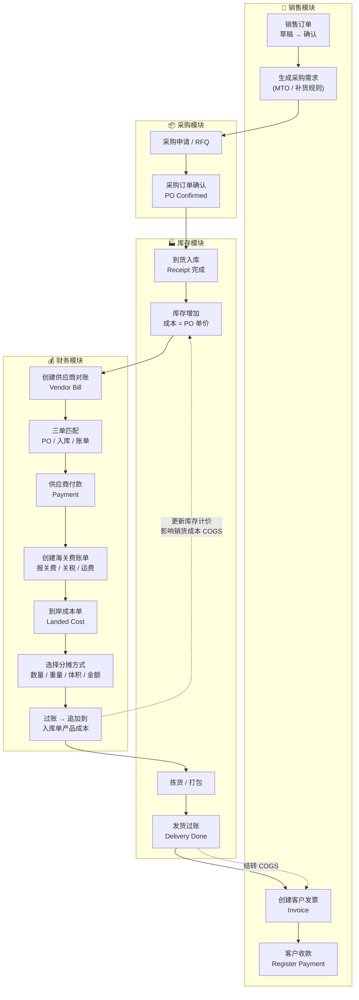
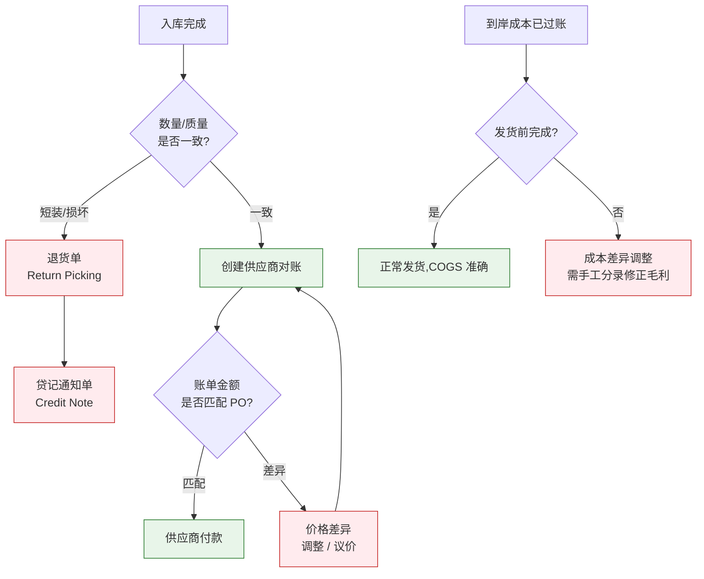

# 销售到发票全流程(含到岸成本均摊)

## 一、主流程(线性视图)

```mermaid
flowchart LR
    A["① 销售订单<br/>Sale Order"] --> B["② 采购订单<br/>Purchase Order"]
    B --> C["③ 入库<br/>Receipt / WH-IN"]
    C --> D["④ 创建供应商对账<br/>Vendor Bill"]
    D --> E["⑤ 供应商付款<br/>Vendor Payment"]
    E --> F["⑥ 创建海关费账单<br/>Customs / Duty Bill"]
    F --> G["⑦ 到岸成本均摊<br/>Landed Cost 追加成本"]
    G --> H["⑧ 发货<br/>Delivery / WH-OUT"]
    H --> I["⑨ 创建发票<br/>Customer Invoice"]

    classDef sale fill:#e3f2fd,stroke:#1565c0,color:#0d47a1
    classDef purchase fill:#f3e5f5,stroke:#6a1b9a,color:#4a148c
    classDef stock fill:#e8f5e9,stroke:#2e7d32,color:#1b5e20
    classDef finance fill:#fff3e0,stroke:#ef6c00,color:#e65100
    class A,I sale
    class B purchase
    class C,H stock
    class D,E,F,G finance
```

## 二、分模块泳道图(带单据与状态)

## 三、关键控制点

| 环节 | 单据 | 关键校验 |
|------|------|----------|
| ① 销售订单 | `sale.order` | 客户信用额度、交期、售价毛利 |
| ② 采购订单 | `purchase.order` | 供应商价目表、采购前置期 |
| ③ 入库 | `stock.picking` (IN) | 数量/批次/序列号、质检 |
| ④ 供应商对账 | `account.move` (in_invoice) | **三单匹配**:PO ↔ 入库 ↔ 账单 |
| ⑤ 供应商付款 | `account.payment` | 付款条件、账期、汇率锁定 |
| ⑥ 海关费账单 | `account.move` (in_invoice) | 费用科目须勾选"**是到岸成本**" |
| ⑦ 到岸成本均摊 | `stock.landed.cost` | 必须选对**入库单**;分摊方式一致性 |
| ⑧ 发货 | `stock.picking` (OUT) | 库存可用量;**发货前完成均摊**才能算准 COGS |
| ⑨ 创建发票 | `account.move` (out_invoice) | 开票策略(按订单/按交货数量) |

## 四、时序要点 ⚠️

> [!warning] 顺序很重要
> **到岸成本均摊(⑦)必须在发货(⑧)之前完成。**
> 若先发货再均摊,已出库产品按旧成本结转 COGS,追加成本只能落在剩余库存或产生差异调整,导致毛利失真。

> [!tip] 实操建议
> 1. 海关/运费账单开出后立即创建到岸成本单并过账
> 2. 到岸成本分摊方式在同一批货物中保持一致(混用会难以追溯)
> 3. 产品计价方法建议用 **FIFO / 平均成本 + 自动计价**,标准成本法下到岸成本无法自动追加
> 4. 期末核对:采购暂收科目(Stock Interim Received)余额应趋近于零

## 五、异常分支

---

相关笔记:[[Odoo 19.0 操作手册/03. 采购与供应链.md]] · [[Odoo 19.0 操作手册/04. 库存与物流.md]] · [[Odoo 19.0 操作手册/06. 会计与财务.md]]
