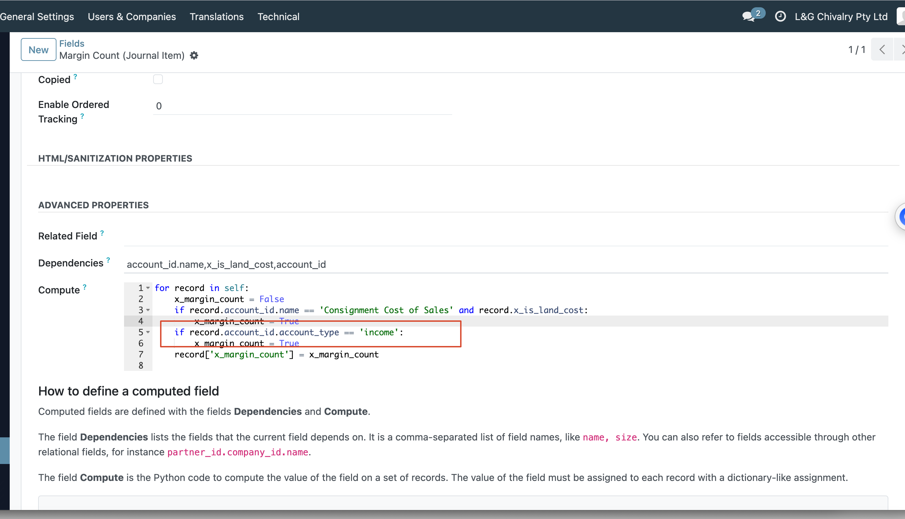
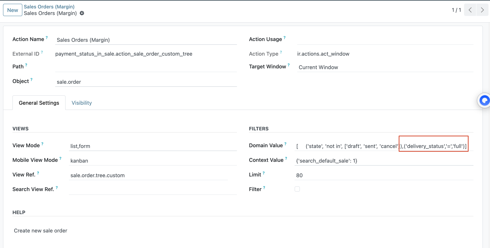
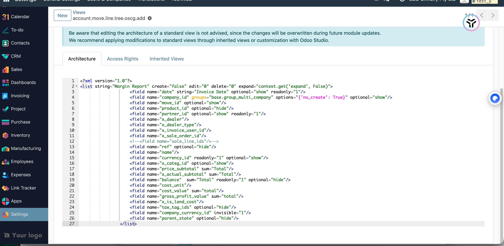
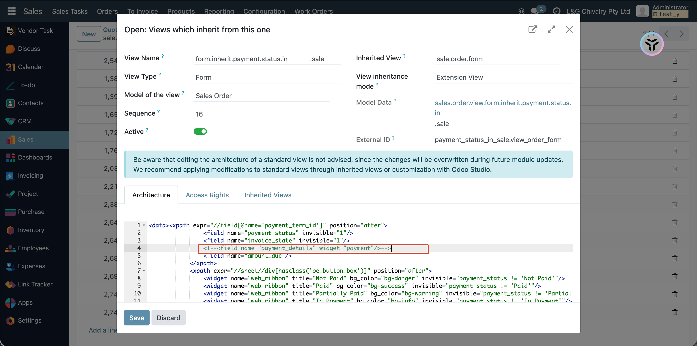
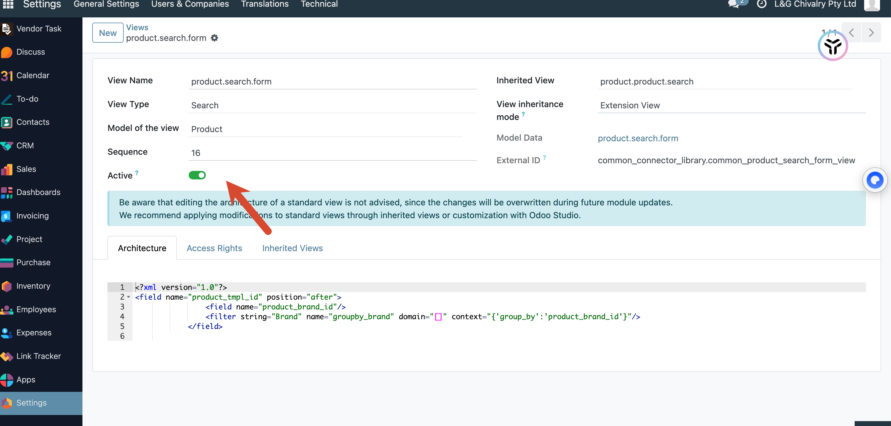
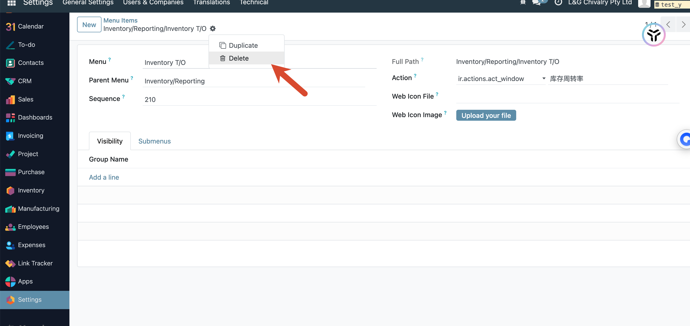

# lgc升级修改

卸载生产、维修模块、common_connector_library

1、搜索字段 x_margin_count

margin report 改成list

从销售订单的quotation、customer invoice均可以打印

需要增补会计模块

搜索product_brand_id，存档掉

菜单Inventory T/O

确实event（analytic account结构变化）
